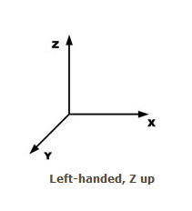

<h1>Cyberpunk2077 Research Documentation</h1>
<h4>This documentation contains reverse engineered information about the game and REDEngine4 file formats that was conducted by contributors of this repository and the community.</h4>

<h3>REDEngine4</h3>

* [Coordinate System](https://docs.microsoft.com/en-us/windows/win32/direct3d9/coordinate-systems): 
This engine has Left-Handed Z Up coordinate system 
 

<h3>File Formats</h3>

* [Anims](./formats/anims.md)
* [Hp](./formats/hp.md)
* [Mesh](./formats/mesh.md)
* [Mi](./formats/mi.md)
* [Mlmask](./formats/mlmask.md)
* [Mlsetup](./formats/mlsetup.md)
* [Mltemplate](./formats/mltemplate.md)
* [Morphtarget](./formats/morphtarget.md)
* [Mt](./formats/mt.md)
* [Opus](./formats/opus.md)
* [Rig](./formats/rig.md)